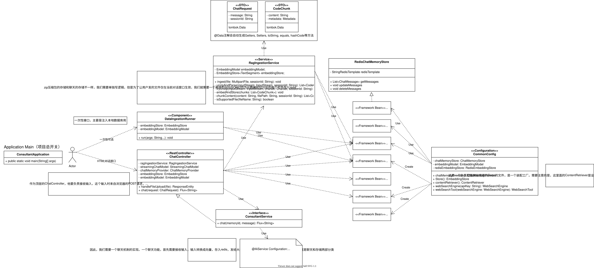

# 我的AI顾问项目 (AI Consultant Project)

<p align="center">
  
  
  
  
</p>

这是一个基于 **Langchain4j** 和 **Spring Boot** 构建的、具备高级RAG（检索增强生成）能力的智能AI顾问。

## 🌟 功能特性

- **动态知识库注入**: 支持通过上传`.zip`格式的项目文件，为AI动态注入与该项目相关的上下文知识。
- **会话隔离与上下文感知**: AI的回答会优先基于当前会话上传的知识库，实现了高度的上下文感知和会话隔离。
- **工具使用能力**: AI被赋予了使用外部工具的能力，例如，可以调用工具来查询或创建现实世界的预约。
- **网络检索能力**: 集成了Tavily搜索引擎，当本地知识库无法满足需求时，AI可以主动上网搜索最新信息来回答问题。
- **流式响应**: 对话接口采用流式输出（Streaming），提供流畅的实时对话体验。
- **持久化会话记忆**: 利用Redis存储短期会话记忆，使得AI能够记住上下文，进行多轮对话。
- **启动时知识预加载**: 可配置在应用启动时，自动加载本地文件（如博客文章）作为基础知识库。

## 🛠️ 技术栈

- **后端框架**: Spring Boot
- **核心AI框架**: Langchain4j
- **数据库/缓存**: Redis (用于向量存储和会话记忆)
- **外部服务**:
  - OpenAI API (或其他大语言模型服务)
  - Tavily Web Search API
- **开发语言**: Java 17+
- **构建工具**: Maven

## 🎨 系统架构

下面是本项目的核心架构UML图，展示了主要组件及其交互关系。



## 🚀 快速开始

请按照以下步骤在本地运行本项目。

### 1. 先决条件

- Java Development Kit (JDK) 17 或更高版本
- Apache Maven
- 一个正在运行的 Redis 实例
- OpenAI API Key 和 Tavily API Key

### 2. 克隆与配置

```bash
# 克隆项目到本地
git clone <your-repository-url>
cd <your-project-directory>
